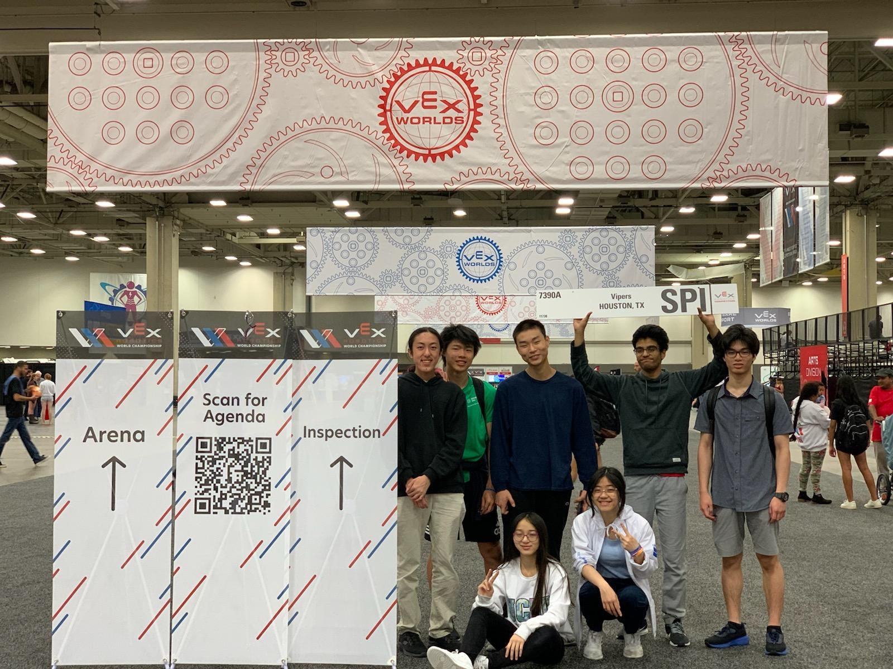

# DeBakey High School's Robotics Page
This is the website for Michael E. DeBakey High School for Health Professions's VRC Robotics team run by Jayden Koh.

<h1 align="center">DeBakey High School's Vipers!</h1>

## Partners:

Zachary Friske's favorite quote: 

> "Nothing happens until something moves..." - Albert Einstein

## Sponsors:

N/A

## 2021-2022 VRC Tipping Point:

#### Railgunawesome (14700H):
A veteran player, he played solo on his own team during the Covid pandemic.

Meet the team:

> Justin Hung (Class of 22)

#### Vipers (7390A):
Playing for Vipers, this was most of our first time's doing robotics at a competitive level. Despite that, we qualified for the Worlds Championships 2022 in Dallas, TX.

A teaser video of our Regionals robot as we prepared for Worlds Championship

A little recap video of our World Championship robot.

Meet the team:

> Rusheel Mitakantti (Class of 23)

> Josephine Duong (Class of 22)

> Jacqueline Duong (Class of 24)

> David Ding (Class of 23)

> William Yun (Class of 23)

> Saatvik Kumar (Class of 23)

> Jayden Koh (Class of 23)

Our group picture lol.

### 2022-2023 VRC Spin Up:

### Contact

[YouTube channel](https://www.youtube.com/channel/UCPRNu3b24dm8QbPjyHDwf6w)

[School Website](https://www.houstonisd.org/debakey) 

Contact teacher at <teacher@houstonisd.org> for school information or Jayden at <jkohhokj@gmail.com> about website or club information.
