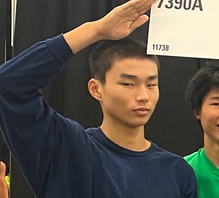

# **DeBakey High School Robotics**
This is the Michael E. DeBakey High School for Health Professions's VRC team page run by Jayden Koh.

<h1 align="center">GO VIPERS!</h1>

## Partners:

Zachary Friske's favorite quote: 

> "Nothing happens until something moves..." - Albert Einstein

## Sponsors:

N/A

---

## 2021-2022 VRC Tipping Point:

Check out a teaser video of our Regionals robot as we prepared for the Worlds Championship.

An overall recap video of our World Championship robot & Tipping Point 2021-2022 season showing how we made variations of the bot throughout the season to tackle on specific game strategies & showing how we progressed throughout the year as we become more experienced. 

  
### Tipping Point Robot Designs:
  
---
  
## 2022-2023 VRC Spin Up:
  
As we prepare for the upcomming season, our design for the bot can be outlined in these basic sketches and CAD models:
  
---

## Meet Debakey Viper's Robotics Team!
  
#### Railgunawesome1 (14700H):
> A veteran player, he played as a one-man-team during the Covid-19 pandemic and qualified for the Vex 2020-2021 Vex Change Up Worlds Competition with a maxed out skills score.

14700H Achievements

     - 69x Judges Awards
     - Detail 1.2
     - 1x Beans
     - 1x Judges Award?
     - 69x Design Award?

| 14700H Achievements                                               |
| ------------------------------------------------------------------|
| 69x Judges Awards               | 1x Judges Award?                |
| 1x Beans                        | 69x Design Award?               |
  
  
  

Click here to view more about Justin
  

<kbd>  </kbd>

  
Justin Hung (Class of 22)  
  
  
(Builder & Programmer)
  
  

  
#### Vipers (7390A):
> Playing for Vipers, this was majority of our club member's first time doing robotics at a competitive level. Despite our novice background, we were able to qualify for the Worlds Championships 2022 in Dallas, TX. With a great start of our first year competing at the Vex Robotics Competition, we plan to continue on and teach our growing club in our school.
 
 

7390A Achievements

     - 1x Tournament Champions Award
     - 1x Tournament Skills Award
     - 1x Worlds Championship Award
     - 1x Regionals  
     - 1x States  
     - 1x Judges Award?    
     - 1x Design Award?   
     - idk old senior   
     - 2x Participation
     - Rank 77 Worlds  :DD 

 
| 7390A Achievements                                                |
| ------------------------------------------------------------------|
| 1x Tournament Champions Award   | 1x Judges Award?                |
| 1x Tournament Skills Award      | 1x Design Award?                |
| 1x Worlds Championship Award    | idk old senior                  |
| 1x Regionals                    | 2x Participation                |
| 1x States                       | Rank 77 Worlds  :DD             |

Click here to view more about our team

<kbd>  </kbd>

  
Rusheel Mitakantti (Class of 23)
(Builder)

<kbd>  </kbd>

  
Josephine Duong (Class of 22)  
(Builder)

  
<kbd>  </kbd> 

  
Jacqueline Duong (Class of 24)  
(Builder)

  
<kbd>  </kbd> 

 
David Ding (Class of 23)  
(Builder)

  
<kbd>  </kbd> 

 
William Yun (Class of 23) 
(Builder)

  
<kbd>  </kbd>

 
Saatvik Kumar (Class of 23)  
(Builder)

  
<kbd>  </kbd>

  
Jayden Koh (Class of 23)  
(Programmer)

  

  
<kbd>  </kbd>

Post-worlds competition photo in Dallas. 

---

### Contact: 

[YouTube channel](https://www.youtube.com/channel/UCPRNu3b24dm8QbPjyHDwf6w "Click to visit 7390A Vipers")

[School Website](https://www.houstonisd.org/debakey "Click to visit Debakey HSHP homepage") 

Contact teacher at <teacher@houstonisd.org> for school information or Jayden at <jkohhokj@gmail.com> about website or club information.

